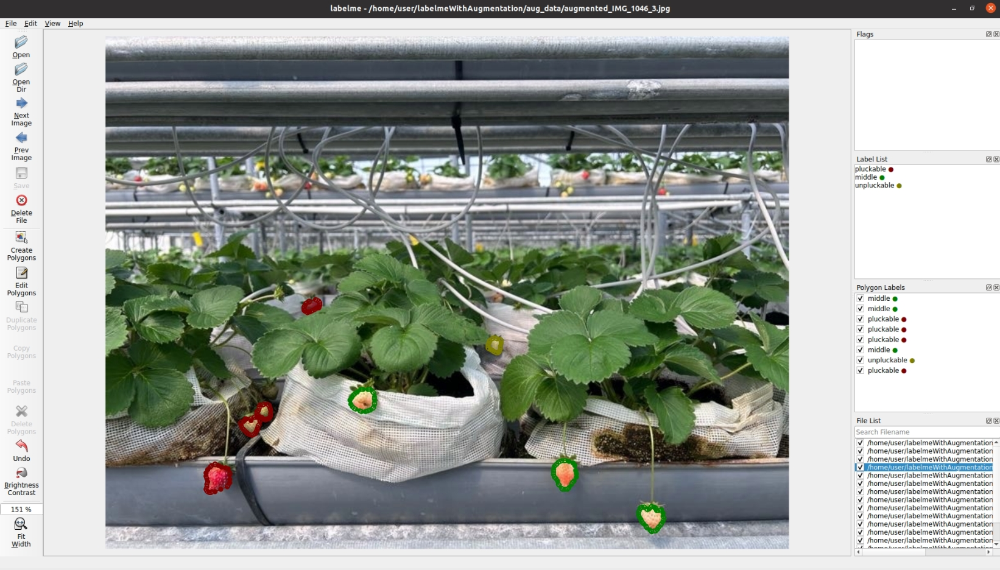
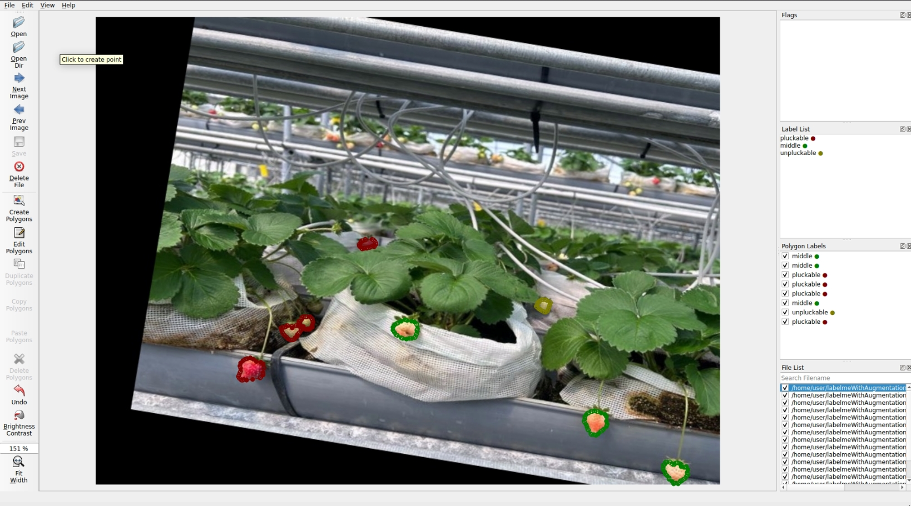
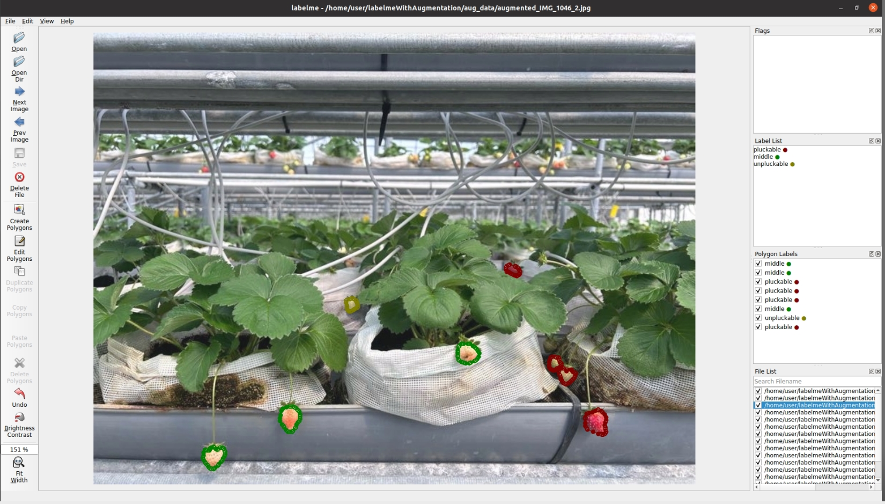

# 將labelme標註好的影像進行資料增強，並轉換成CoCo格式

此程式首先對欲處理資料夾進行訓練/驗證集拆分，之後使用 Albumentations 庫對圖片進行增強，並對應更新 JSON 標註文件，最後轉換成CoCo格式方便後續訓練。

## 解決問題
[labelme2coco](https://github.com/fcakyon/labelme2coco) 雖然可以方便拆分訓練與驗證集，但是在轉換coco格式的功能中，標籤(Label)順序依照讀取影像標註而定，造成訓練集與驗證集的json標籤(Label)內容不一致，使後續模型訓練出現問題。

## 功能

- **圖片增強：** 使用 Albumentations 庫對圖片進行平移、縮放、旋轉和水平翻轉等操作。
- **多邊形標註處理：** 圖片變換後，自動調整對應的多邊形標註(Polygon)。
- **邊界處理：** 將超出圖像邊界的標註點限制在圖像內，避免資料增強後的標記錯誤。
- **移除邊界標註：** 如果多邊形標註的 90% 或更多的點位於圖像邊界上，則該標註會被移除。
- **輸出管理：** 增強後的圖片和更新的標註文件會保存到輸出文件夾中，並可以轉換成CoCo格式，並且固定輸出的Label順序，解決順序，解決labelme2coco的隨機標籤順序問題。
- **自定義：** 使用者可透過修改 Albumentations 的 `Compose()` 部分來自定義增強流程。

## 執行結果
- Original img  


- Image after data augmentation  
  


## 系統需求(TODO ....)

- Python 3.8.19
- 以下 Python 庫：
  - `albumentations`
  - `opencv-python`
  - `numpy`
  - `json`
  - `matplotlib`
  - `tqdm`
  - `labelme2coco`

你可以使用以下命令安裝所需的庫：

```bash
pip install albumentations opencv-python numpy matplotlib tqdm labelme2coco
```

## 使用方法

1. **準備輸入資料夾：** 建立一個名為 `input_data` 的文件夾，並將你的圖片和相應的 JSON 標註文件放入該文件夾。每張圖片必須有一個相同名稱的 `.json` 標註文件（例如：`image.jpg` 和 `image.json`）。

2. **輸出文件夾：** 增強後的圖片和更新的 JSON 文件將會保存到 `labelme_data` 文件夾中。

3. **如果需要轉換格式至coco, 則需要在 `config.yaml` 中輸入標記類別有哪些**

    ```bash
    # 原始檔案有4個標記類別，使用者要自己修改這邊的標記類別
    Fixed_categories : ['pluckable', 'unpluckable', 'middle', 'other']
    ```

4. **執行程式：**
   
   ```bash
   python data_augmentation.py
   ```

   腳本將處理 `input_data` 文件夾中的所有圖片，對圖片進行增強，並調整相應的 JSON 文件。結果會保存到 `labelme_data` 、`coco`文件夾中。

## 文件結構範例

```
input_data/
│
├── image1.jpg
├── image1.json
├── image2.jpg
├── image2.json

labelme_data/
```


## 自定義資料增強

通過修改程式中的 Albumentations `Compose()` 部分來調整增強方式：

```python
transform = A.Compose([
    A.ShiftScaleRotate(shift_limit=0.1, scale_limit=0.2, rotate_limit=30, p=1.0, 
                       border_mode=cv2.BORDER_CONSTANT, value=(0, 0, 0)),  # 黑色背景填充
    A.HorizontalFlip(p=0.5),
],
    keypoint_params=A.KeypointParams(format='xy', remove_invisible=False)
)
```